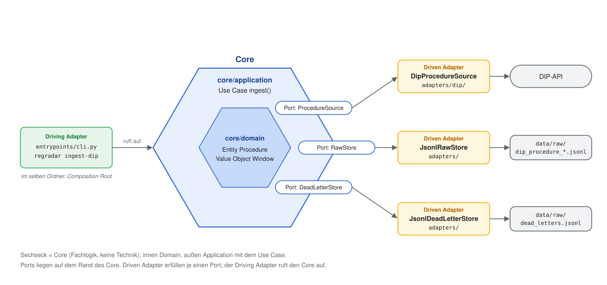
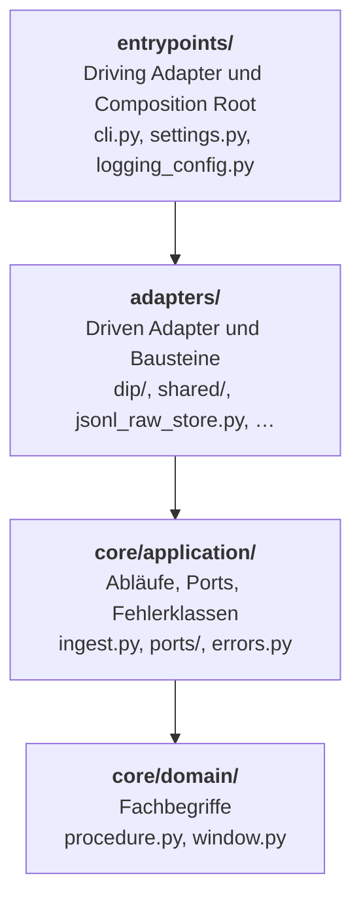
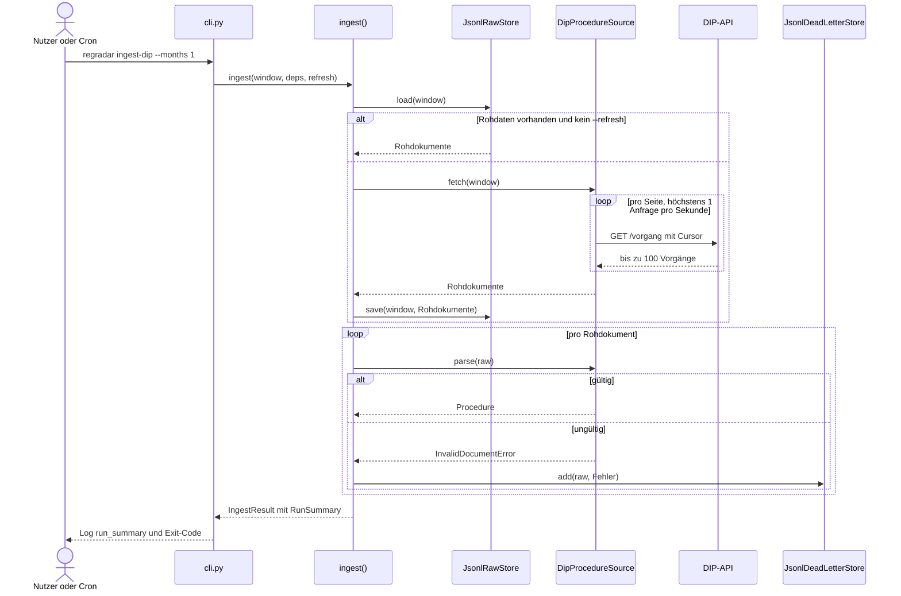

# Architektur RegRadar

**RegRadar beobachtet Gesetzgebung und zeigt regulierten Branchen, was sie
betrifft – am Beispiel von Banken und Versicherern.** Vorgänge aus Bundestag
und Bundesrat (später EU) werden täglich geholt, einmal per LLM eingeordnet
und im Browser filterbar gemacht. Weitere Branchen sind Konfiguration, kein
Code; ihre Erkennung wird wie bei den Beispielen gegen ein gelabeltes Testset
gemessen.

- **Zero Cost:** Betrieb nur mit GitHub Actions, Releases und Pages. Kosten
  entstehen nur für das LLM, höchstens 5–10 €/Monat
  ([ADR-0010](adr/0010-datenfluss-und-hosting.md)).
- **Serverless ETL:** Jeder Lauf schreibt eine DuckDB-Datei, das Frontend
  liest sie per DuckDB-WASM direkt im Browser. Kein Server, keine externe
  Datenbank ([ADR-0010](adr/0010-datenfluss-und-hosting.md)).
- **Classify once, filter many:** Jeder Vorgang wird einmal mit festen
  Vokabularen eingeordnet; Filtern kostet danach nichts mehr
  ([ADR-0002](adr/0002-classify-once-filter-many.md)).
- **Ports & Adapters:** Die Fachlogik kennt weder Quelle noch Speicher. Eine
  neue Quelle ist ein neuer Adapter
  ([ADR-0009](adr/0009-architekturvokabular-und-benennung.md)).
- **Agent-driven Development:** Der Code entsteht mit einem KI-Agenten im
  Dev-Container ([ADR-0008](adr/0008-agentische-entwicklung-im-dev-container.md)),
  abgesichert durch deterministische Qualitäts-Gates in der CI
  ([ADR-0006](adr/0006-qualitaets-gates.md)) und ein Review jedes PRs.

**Stand:** Ingest aus DIP fertig (T01). Vorfilter, Klassifikation und Frontend
folgen.

## Über dieses Dokument

Dieses Dokument erklärt die Architektur **am Projekt**: Jeder Begriff kommt mit
einem Beispiel aus unserem Code. Was RegRadar fachlich tut, steht in
[fachkonzept.md](fachkonzept.md). Die Benennungsregeln sind in
[ADR-0009](adr/0009-architekturvokabular-und-benennung.md) festgelegt.

Das Dokument wird mit jedem Ticket aktualisiert, sobald sich Struktur, Begriffe
oder Abläufe ändern. Die Diagramme sind in Mermaid geschrieben und werden von
GitHub direkt angezeigt.

## Grundidee: Ports & Adapters (hexagonale Architektur)

Der **Core** enthält die gesamte Fachlogik und weiß nichts von Technik: nicht,
dass die Daten aus einer HTTP-API kommen, und nicht, dass sie in JSONL-Dateien
landen. Der Core beschreibt nur, **was** er braucht (**Ports**). **Adapter**
liefern das **wie**.

Faustregel: *Würde sich die Regel ändern, wenn wir die Technik austauschen?*
Nein → Core. Ja → Adapter.



Für eine neue Quelle (EUR-Lex) oder einen neuen Speicher (DuckDB) kommt nur ein
neuer Adapter hinzu. Core und andere Adapter bleiben unverändert.

## Schichten und erlaubte Importe

Der Code liegt unter `src/regradar/` in drei Ordnern: `entrypoints/`,
`adapters/` und `core/`, der Core wiederum in `application/` und `domain/`.
Importe dürfen nur **nach unten** zeigen. `import-linter` prüft das bei jedem
`make check`; ein Verstoß lässt den Check scheitern.



Zusätzlich gilt: `core/domain/` importiert keine I/O-Bibliotheken (`httpx`,
`structlog`, `pydantic_settings`).

## Ablauf eines Laufs



**Exit-Codes:**
- `0`: erfolgreich, ggf. mit Warnung bei einzelnen Fehlern
- `1`: Fehlerquote über 5 % oder Bilanz geht nicht auf
- `2`: Abbruch wegen eines systemischen Fehlers oder falscher Argumente

## Begriffe

### Core

Alles, was Fachlogik enthält, im Ordner `core/`: `core/domain/` und
`core/application/`.

### Entity

Fachobjekt mit **eigener Identität**. Es bleibt dasselbe Objekt, auch wenn sich
Werte ändern.
**Bei uns:** `Procedure` in `core/domain/procedure.py`. Identität ist
`source` + `source_id` (z. B. `dip` + `338726`). Ändert sich der
Beratungsstand, ist es immer noch derselbe Vorgang.

### Value Object

Fachobjekt **ohne** Identität. Zwei Value Objects sind gleich, wenn alle Werte
gleich sind. Unveränderlich.
**Bei uns:**
- `Window` in `core/domain/window.py` (Zeitraum: Start, Ende, Feld). Prüft
  selbst, dass Start nicht nach Ende liegt.
- `Descriptor` in `core/domain/procedure.py` (Schlagwort mit Typ)

### Use Case

Ein Anwendungsfall, also ein fachlicher Ablauf von Anfang bis Ende. Er
koordiniert Domain-Objekte und Ports, enthält aber keine Technik.
**Bei uns:** `ingest()` in `core/application/ingest.py`: Rohdaten laden oder
abholen, jedes Dokument prüfen, Fehlerhaftes zurückstellen, Doppeltes
verwerfen, Bilanz (`RunSummary`) ziehen.

### Port

Eine Schnittstelle, die der Core definiert, um zu sagen, *was* er von außen
braucht. In Python ein `Protocol`.
**Bei uns** im Ordner `core/application/ports/`, eine Datei je Port:

| Port | Datei | Aufgabe |
|---|---|---|
| `ProcedureSource` | `procedure_source.py` | Vorgänge für einen Zeitraum abholen (`fetch`) und in `Procedure` umwandeln (`parse`) |
| `RawStore` | `raw_store.py` | Rohdaten eines Zeitraums speichern (`save`) und wieder laden (`load`) |
| `DeadLetterStore` | `dead_letter_store.py` | Fehlerhaftes Dokument mit Fehlergrund zurückstellen (`add`) |

`raw_document.py` definiert den Typ `RawDocument`, also ein Dokument so, wie
die Quelle es geliefert hat, noch ungeprüft. Alle drei Ports nutzen ihn.

Die Fehlerklassen stehen in `core/application/errors.py`: `SystemicError`
(z. B. `AuthenticationError`) bricht den Lauf ab, `InvalidDocumentError`
betrifft nur ein Dokument.

### Adapter (driving und driven)

Konkrete Umsetzung eines Ports mit einer bestimmten Technik.

- **Driving Adapter** (primär) **ruft den Core auf**.
  **Bei uns:** die CLI `entrypoints/cli.py`. Später kommt der tägliche Cron
  in GitHub Actions dazu, der ebenfalls nur die CLI aufruft.
- **Driven Adapter** (sekundär) **wird vom Core aufgerufen** und erfüllt einen
  Port.
  **Bei uns:** `DipProcedureSource` (erfüllt `ProcedureSource`),
  `JsonlRawStore` (erfüllt `RawStore`), `JsonlDeadLetterStore` (erfüllt
  `DeadLetterStore`).

**Wichtig:** Der Ordner `adapters/` enthält die Adapter **und** ihre
Bausteine. Nicht jede Datei darin ist ein Adapter, sondern nur die Klassen,
die einen Port erfüllen.

### Baustein

Technische Hilfsfunktion oder -klasse, die ein Adapter intern nutzt. Ein
Baustein erfüllt keinen Port und wird nie vom Core aufgerufen.

- **Gemeinsame Bausteine**, die mehrere Adapter nutzen (können), liegen in
  `adapters/shared/`.
- **Adapterspezifische Bausteine** liegen im Ordner ihres Adapters, z. B.
  `adapters/dip/`.
- Jedes Baustein-Modul beginnt mit dem Docstring `Building block (…): …`.
  Alle Bausteine findet man so:
  ```bash
  grep -rn "Building block" src
  ```

| Datei | Baustein | Genutzt von | Zweck |
|---|---|---|---|
| `adapters/shared/file_writer.py` | `write_file_atomically()` | `JsonlRawStore` | Datei atomar schreiben (siehe unten) |
| `adapters/dip/api_dto.py` | `DipProcedureDto`, `DipPageDto`, `DipDescriptorDto` | `DipProcedureSource` | DIP-Antworten prüfen (DTO) |
| `adapters/dip/rate_limit.py` | `RateLimiter` | `DipProcedureSource` | höchstens 1 Anfrage pro Sekunde |
| `adapters/dip/web_url.py` | `procedure_web_url()` | `DipProcedureSource` | Link zur DIP-Webseite eines Vorgangs |

### Composition Root

Die **eine** Stelle, an der entschieden wird, welche konkreten Adapter
verwendet werden, und an der sie zusammengesteckt werden (Dependency
Injection).
**Bei uns:** `ingest_dip()` in `entrypoints/cli.py`. Tests stecken an
derselben Stelle Fakes ein, z. B. eine simulierte DIP-API.

### DTO (Data Transfer Object)

Bildet die Antwort einer externen API 1:1 ab und prüft sie.
**Bei uns:** `DipProcedureDto`, `DipPageDto`, `DipDescriptorDto` in
`adapters/dip/api_dto.py`, mit Pydantic. Sie verwenden die DIP-Feldnamen
(`titel`, `vorgangstyp`) und werden sofort auf `Procedure` umgesetzt.

### Anti-Corruption Layer

Schutzschicht, die verhindert, dass Begriffe und Eigenheiten einer fremden
Schnittstelle in den Core „einsickern“.
**Bei uns:** DTOs plus `to_procedure()` in
`adapters/dip/dip_procedure_source.py`. Der Core kennt kein `vorgangstyp`, nur
`procedure_type`.

### Dead Letter

Ein Dokument, das nicht verarbeitet werden konnte. Es wird mit Fehlergrund
beiseitegelegt, statt den Lauf abzubrechen (ADR-0007).
**Bei uns:** `data/raw/dead_letters.jsonl`, eine JSON-Zeile pro Dokument mit
`failed_at`, `error` und `document`.

### Rate-Limit und Retry

- **Rate-Limit:** höchstens eine Anfrage pro Sekunde an DIP
  (`adapters/dip/rate_limit.py`).
- **Retry mit exponentiellem Backoff:** bei 429, 5xx oder Netzwerkfehlern
  bis zu 5 Versuche mit 1, 2, 4, 8 s Pause (`RetryPolicy`).
- Kein Retry bei anderen 4xx. 401/403 bricht als `AuthenticationError` ab.

### Atomares Schreiben

Eine Datei wird erst vollständig in eine temporäre Datei geschrieben und dann
in einem Schritt umbenannt. Nach einem Absturz liegt also nie eine halbe
Datei vor, die beim nächsten Lauf unbemerkt als vollständig gelesen würde.
**Bei uns:** Baustein `write_file_atomically()` in
`adapters/shared/file_writer.py`, genutzt von `JsonlRawStore`.

### Cassette

Eine **aufgezeichnete echte API-Antwort** für Tests. Beim ersten Aufnehmen
spricht der Test einmal mit der echten DIP-API. Danach spielt er die
Aufzeichnung ab, ohne Netzwerk, schnell und reproduzierbar. Werkzeug:
VCR.py über `pytest-recording`.

**Bei uns:**
- Datei:
  `tests/cassettes/test_dip_cassette/test_fetches_and_parses_real_response.yaml`
- Test: `tests/adapters/test_dip_cassette.py`. Er deckt einen Tag ab und
  macht zwei Anfragen: eine Seite mit 23 echten Vorgängen, dann die leere
  Abschlussseite mit unverändertem Cursor.
- Beim Aufnehmen bereinigt `tests/conftest.py`:
  - Der API-Key wird aus der URL entfernt.
  - Der DIP-Cursor wird durch `recorded-cursor-N` ersetzt, weil der
    Secret-Scan ihn sonst meldet.
  - Die Vorgänge selbst bleiben unverändert.
- Neu aufnehmen:
  ```bash
  rm -r tests/cassettes/test_dip_cassette
  DIP_API_KEY=… uv run pytest tests/adapters/test_dip_cassette.py --record-mode=once
  ```

Alle übrigen Adapter-Tests simulieren die API mit `httpx.MockTransport`. So
lassen sich auch Fehlerfälle wie 429, 401 und Netzwerkfehler gezielt testen.

## Ordnerstruktur

```
src/regradar/
├── core/                           Core
│   ├── domain/                     Fachbegriffe
│   │   ├── procedure.py            Entity Procedure, Value Object Descriptor
│   │   └── window.py               Value Object Window (Zeitraum)
│   └── application/                Abläufe
│       ├── ports/
│       │   ├── procedure_source.py Port ProcedureSource
│       │   ├── raw_store.py        Port RawStore
│       │   ├── dead_letter_store.py Port DeadLetterStore
│       │   └── raw_document.py     Typ RawDocument (ungeprüfte Rohdaten)
│       ├── errors.py               Fehlerklassen (systemisch / einzelnes Dokument)
│       └── ingest.py               Use Case ingest(), RunSummary
├── adapters/                       Driven Adapter und ihre Bausteine
│   ├── dip/
│   │   ├── dip_procedure_source.py Adapter DipProcedureSource
│   │   ├── api_dto.py              Baustein: DTOs der DIP-Antwort
│   │   ├── rate_limit.py           Baustein: RateLimiter
│   │   └── web_url.py              Baustein: Link zur DIP-Webseite
│   ├── shared/
│   │   └── file_writer.py          Baustein: write_file_atomically()
│   ├── jsonl_raw_store.py          Adapter JsonlRawStore
│   └── jsonl_dead_letter_store.py  Adapter JsonlDeadLetterStore
└── entrypoints/                    Driving Adapter und Composition Root
    ├── cli.py                      regradar ingest-dip
    ├── settings.py                 DIP_API_KEY aus Umgebung/.env
    └── logging_config.py           structlog, JSON

tests/                              spiegelt src/
├── core/                           Tests für domain/ und application/
├── adapters/                       Tests für Adapter und Bausteine
├── entrypoints/                    Tests für die CLI
├── cassettes/                      aufgezeichnete API-Antworten
├── conftest.py                     gemeinsame Test-Konfiguration
└── factories.py                    Testdaten
```

## Qualitäts-Gates (`make check`)

| Werkzeug | Prüft |
|---|---|
| `ruff check` | Code-Regeln, u. a. keine stillen Fehler (ADR-0007), Sicherheit, Komplexität |
| `ruff format` | einheitliche Formatierung, Zeilenlänge 80 |
| `mypy --strict` | vollständige, korrekte Typen |
| `lint-imports` | Schichtenregeln (siehe oben) |
| `xenon` | Komplexität: keine Funktion über B, Durchschnitt A |
| `bandit` | typische Sicherheitsprobleme |
| `deptry` | deklarierte und genutzte Abhängigkeiten passen zusammen |
| `detect-secrets` | keine Schlüssel oder Passwörter im Repo |
| `pytest` + Coverage | alle Tests grün, Branch-Coverage ≥ 80 % |
| `diff-cover` | geänderte Zeilen ≥ 90 % abgedeckt |

## Wo füge ich was hinzu?

| Vorhaben | Wo |
|---|---|
| Neue Quelle, z. B. EUR-Lex | `adapters/eurlex/` mit `EurlexProcedureSource` (erfüllt `ProcedureSource`) und eigenen DTOs; in `entrypoints/cli.py` zusammenstecken. Core bleibt unverändert. |
| Neuer Speicher, z. B. DuckDB | Neuer Adapter, der einen Port erfüllt (z. B. `DuckdbRawStore` oder ein neuer Port für gespeicherte Vorgänge) |
| Hilfsfunktion für einen Adapter | Als Baustein in den Ordner des Adapters; nutzen ihn mehrere Adapter, nach `adapters/shared/`. Docstring `Building block (…): …` |
| Neues Fachmerkmal eines Vorgangs | Feld in `Procedure`, Abbildung im DTO, Eintrag im Fachkonzept |
| Neue Branche oder neue Suchbegriffe | Konfiguration, nicht Code (Keyword-Vorfilter ab T01b) |
| Neue fachliche Regel | `core/domain/` (gilt immer) oder `core/application/` (gehört zu einem Ablauf) |

## Bekannte Abweichungen von ADRs

- ADR-0003 nennt die Quell-Schnittstelle `iter_documents(window)`. Umgesetzt
  ist `ProcedureSource` mit `fetch(window)` und `parse(raw)`. Die Trennung
  erlaubt, Rohdaten zu speichern, bevor geprüft wird.
- ADR-0007: Erneuter Versuch zurückgestellter Dokumente und Freshness-Alarm
  sind noch nicht umgesetzt.
