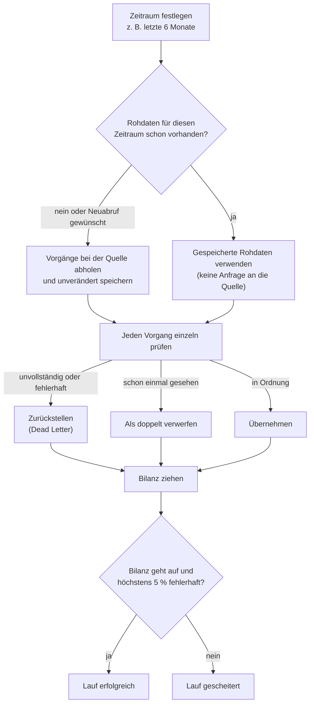

# Fachkonzept RegRadar

Dieses Dokument erklärt **fachlich**, was RegRadar tut und was die Begriffe
bedeuten. Es enthält bewusst keine Technik. Wie das im Code umgesetzt ist,
steht in [architektur.md](architektur.md).

Das Dokument wird mit jedem Ticket aktualisiert, sobald sich Begriffe oder
Abläufe ändern.

## Worum geht es?

Unternehmen in regulierten Branchen müssen früh wissen, welche Gesetze,
Verordnungen und Vorgaben auf sie zukommen. Die Informationen sind öffentlich,
aber verstreut, zahlreich und schwer zu filtern.

RegRadar sammelt regulatorische Vorgänge aus öffentlichen Quellen, ordnet sie
**einmal** nach festen Merkmalen ein (z. B. Branche, Regelwerk, Stand) und
macht sie über **Profile** filterbar. Ein Profil beschreibt, was eine
Zielgruppe interessiert, etwa „IT-Sicherheit bei Versicherern“.

**Banken und Versicherer sind nur Beispiele.** Welche Branchen, Regelwerke und
Suchbegriffe es gibt, wird konfiguriert und ist nicht fest eingebaut. Dieselbe
Sammlung kann genauso für Energieversorger, Pharma oder den öffentlichen Sektor
dienen.

## Quellen

| Quelle | Inhalt | Stand |
|---|---|---|
| **DIP** – Dokumentations- und Informationssystem für Parlamentsmaterialien | Alles, was in Bundestag und Bundesrat beraten wird | angebunden |
| **EUR-Lex** | Rechtsakte und Gesetzgebungsverfahren der EU | geplant |

Bei jeder Weitergabe von DIP-Daten ist die Quelle „Deutscher
Bundestag/Bundesrat – DIP“ anzugeben, und Veränderungen sind kenntlich zu
machen (ADR-0005). Jeder Eintrag behält deshalb einen Verweis auf sein
Original.

## Begriffe

### Procedure (Vorgang)

Die zentrale Einheit von RegRadar. Ein **Vorgang** ist die Klammer um ein
parlamentarisches Verfahren und bündelt alle zugehörigen Dokumente und Schritte.
Beispiele:

- **Gesetzgebung:** ein Gesetz vom Entwurf über die Beratungen bis zur
  Verkündung
- **Kleine Anfrage:** die Frage einer Fraktion und die Antwort der
  Bundesregierung
- **EU-Vorlage:** ein EU-Dokument, das Bundestag oder Bundesrat zugeleitet
  wird

Im Projekt heißt der Vorgang **Procedure**, nach dem Begriff der EU
(„legislative procedure“). So passt derselbe Begriff später auch für
EUR-Lex-Verfahren.

Für die Zielgruppe ist der Vorgang die richtige Einheit: Interessant ist „das
Gesetz zur Umsetzung von DORA und sein aktueller Stand“, nicht jedes einzelne
Dokument.

### Merkmale eines Vorgangs

| Begriff | Bedeutung | Beispiel |
|---|---|---|
| **Titel** | Bezeichnung des Vorgangs | „Gesetz zur Modernisierung des Berufsrechts der Wirtschaftsprüfer“ |
| **Abstract** | Kurze Inhaltsangabe; nur bei rund jedem fünften Vorgang vorhanden | |
| **Vorgangstyp** | Art des Verfahrens | Gesetzgebung, Kleine Anfrage, Antrag, EU-Vorlage, Rechtsverordnung |
| **Beratungsstand** | Wo das Verfahren gerade steht | „Noch nicht beraten“, „Beantwortet“, „Verkündet“ |
| **Initiative** | Wer den Vorgang angestoßen hat | Bundesregierung, eine Fraktion, Bundesrat, ein Land |
| **Sachgebiet** | Grobe Themenzuordnung aus einer festen Liste des DIP | „Wirtschaft“, „Recht“, „Innere Sicherheit“ |
| **Deskriptor** | Feines Schlagwort aus dem Thesaurus des Bundestags, von Dokumentaren vergeben | „Kreditinstitut“, „Geldwäsche“, „Jemen“ |
| **Wahlperiode** | Legislaturperiode des Bundestags | 21 |
| **Datum** | Datum des jüngsten Dokuments im Vorgang | 2026-09-22 |
| **Aktualisiert** | Zeitpunkt der letzten Änderung des Eintrags im DIP | 2026-09-28 07:11 |

### Dokumente im Vorgang

| Begriff | Bedeutung |
|---|---|
| **Drucksache** | Offizielles Dokument mit Nummer, z. B. 21/1234: Gesetzentwurf, Antrag, Anfrage, Antwort, Beschlussempfehlung |
| **Plenarprotokoll** | Wortprotokoll einer Sitzung von Bundestag oder Bundesrat |

RegRadar lädt derzeit nur die Vorgänge mit ihren Merkmalen, nicht die
Dokumente selbst.

### Zeitraum, Backfill und Delta

Jeder Lauf bezieht sich auf einen **Zeitraum** (von, bis) und auf eines von
zwei Merkmalen:

- **nach Datum:** „Alle Vorgänge mit Dokumenten aus dem September“. Das ist der
  **Backfill**, also das Nachladen der Vergangenheit, z. B. die letzten
  6 Monate.
- **nach Aktualisierung:** „Alles, was sich seit gestern geändert hat“. Das ist
  das **Delta** für den täglichen Betrieb (geplant).

Beide nutzen denselben Ablauf (ADR-0003).

## Ablauf eines Laufs

### Regeln (ADR-0007)

- **Ein fehlerhafter Vorgang stoppt nicht den ganzen Lauf.** Er wird
  zurückgestellt (*Dead Letter*, „unzustellbarer Brief“) und mit Fehlergrund
  aufbewahrt; der Lauf geht weiter.
- **Abbruch nur bei grundsätzlichen Problemen:** Zugangsschlüssel ungültig,
  Quelle dauerhaft nicht erreichbar, Konfiguration fehlt.
- **Bilanz:** geladen = übernommen + verworfen + zurückgestellt. Geht die
  Rechnung nicht auf, ist etwas verloren gegangen, und der Lauf gilt als
  gescheitert.
- **Fehlerquote:** Mehr als 5 % zurückgestellte Vorgänge → Lauf gescheitert.
  Darunter: Lauf erfolgreich, aber mit Warnung.
- **Schonender Abruf:** höchstens eine Anfrage pro Sekunde an die Quelle; bei
  vorübergehenden Störungen mehrere Versuche mit wachsender Pause.

Noch nicht umgesetzt, aber in ADR-0007 beschlossen: zurückgestellte Vorgänge im
nächsten Lauf erneut versuchen, Alarm bei ausbleibenden neuen Daten.

## Ausblick

| Schritt | Fachlicher Inhalt |
|---|---|
| Keyword-Vorfilter (T01b) | Suchbegriffe je Themengruppe (z. B. „Geldwäsche“, „DORA“) markieren potenziell relevante Vorgänge. Gruppen sind konfigurierbar. |
| Einordnung (ADR-0002) | Jeder Vorgang wird **einmal** nach festen Merkmalen eingeordnet: Branche, Regelwerk/Thema, Stand. Später auch betroffene Funktion (Compliance, IT, Risiko …). |
| Profile | Ein Profil ist ein Filter über diese Merkmale, z. B. „Branche = Versicherer und Thema = IT-Sicherheit“. Ein neues Profil braucht keine neue Einordnung. |
| Weitere Quellen | EUR-Lex, später ggf. Aufsichtsbehörden |
